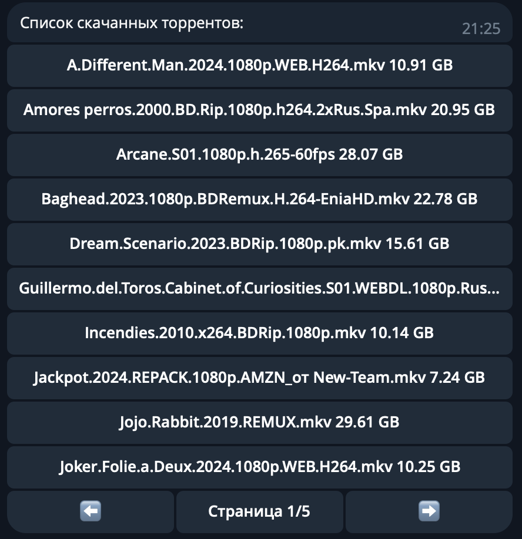
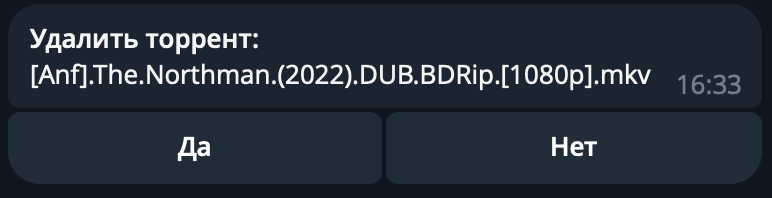
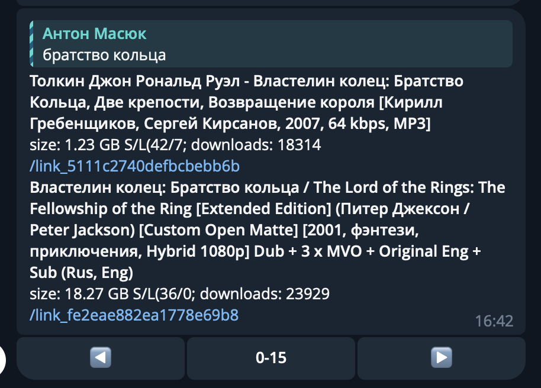

Бот для управления скачанными файлами в торрент-качалках Transmission, QBittorrent.

Работает на https web хуках через ngrok. Можно использовать бесплатный аккаунт, создав статичный адрес и получив ключ от api.

### Возможности
- Ставить на закачку файлы по magnet ссылке
- Просматривать скачанные торренты в inline клавиатуре  
- Удалять скачанные торренты  
- Искать торренты на api [freedomist](https://exfreedomist.com/) (требуется токен)  
- Искать торренты напрямую с сайтов-агрегаторов (в процессе разработки)

### Использование:

- Создать файл .env в рабочем каталоге
- Внести переменные окружения (примеры можно посмотреть в [файле](infra/.env.example))
- Скачать файл [docker-compose.yml](docker-compose.yml) из корня проекта
- Запустить `docker compose up`

### Технологии:
- Aiogram 3
- Beautifulsoup
- Jinja2
